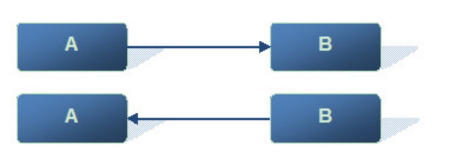

# 网络编程
## 一. 通信理论

计算机与外界的信息交换称为通信。基本的通信方法有并行通信和串行通信两种:

1. 一组信息（通常是**字节**）的各位数据被**同时传送**的通信方法称为并行通信。并行通信依靠并行I／O接口实现。并行通信速度快，但传输线根数多，只适用于近距离（相距数公尺）的通信。

2. 一组信息的各位数据被**逐位顺序传送**的通信方式称为串行通信。串行通信可通过串行接口来实现。串行通信速度慢，但传输线少，适宜长距离通信。

串行通信按信息传送方向分为以下3种：

- **单工**: 只能一个方向传输数据

- **半双工**: 信息能双向传输，但不能同时双向传输

- **全双工**: 能双向传输并且可以同时双向传输

