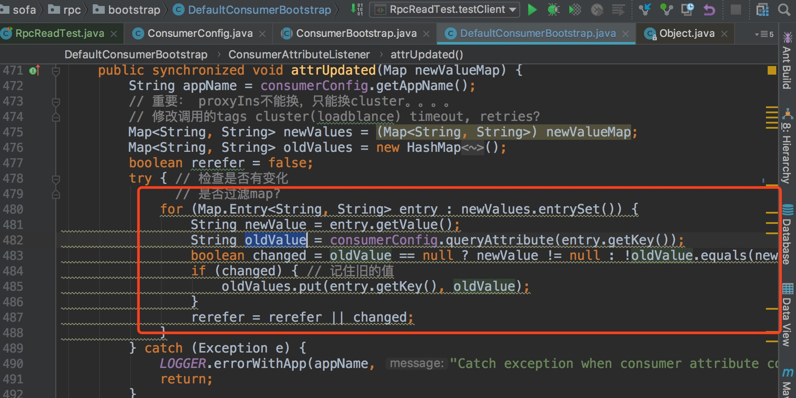

# sofa 学习思考
## sofa boot
1. sofa boot 提供的功能自己在业务哪些地方可以使用上？ 当时出于什么情景下设计了这样的东西？单纯为了 更好地和 中间件兼容么？
2. 如何合理规划依赖的包？特别是包版本定义，防止业务端和自己使用的包 发送冲突？
3. mvn 需要学习
4. 为什么sofa 可以在内部推广开来？
5. 三种发布方式各自优缺点在哪里？如何取舍？---
6. 为什么要提供者三种类型的方式？是业务决定的？还是之前就想好应该有这三种
   - 刚好和spring的三种配置方式一一对应
7. sofaboot 是基于 spring-boot 开发。是否意味着spring-boot一旦升级，这边也要跟着一起升级
8. 是否存在和spring-boot不同版本的兼容性问题？如何做到和spring-boot版本无依赖性？
9. 如果不想在模块中做隔离？sofa应该怎么做？
    - 通过特殊的配置，如 sofa-module.properties 
    - META-INF/spring 目录下存放 Spring 配置文件
10. 学习命名规范、代码规范
11. Require-Module 是否存在循环依赖问题？如果有sofa是如何解决的？

## sofa rpc
1. 协议指的是什么？怎么理解协议这个词
2. sofa-rpc 和 dubbo 设计相同和区别在哪
3. sofa-rpc 相对 dubbo 有什么优势
4. 是否和dubbo一样每一层，每个部分都可以被替换。类似内核设计
5. sofaboot 的标签解析后 如何 和 ProviderConfig 关联到一起？ 在哪里调用
6.  RpcInternalContext.getContext().setFuture(future); 方式解决不了同一个线程中进行多个异步调用的处理逻辑
7. 这里是否有bug  删除的配置没法体现

8. tracer rpc 方式无法上传到 zkipkin 中

## 代码问题
1. 快速开始的  Commit-Id，Commit-Time  这些信息是如何获取的，保存在哪里？
2. 健康检查都包含哪些内容？
3. 日志级别如何修改

## sofa boot
SOFABoot 是在 Spring Boot 的基础上提供的功能扩展。基于 Spring Boot 的机制，SOFABoot 管理了 SOFA 中间件的依赖，并且提供了 Spring Boot 的 Starter，**方便用户在 Spring Boot 中使用 SOFA 中间件**。

